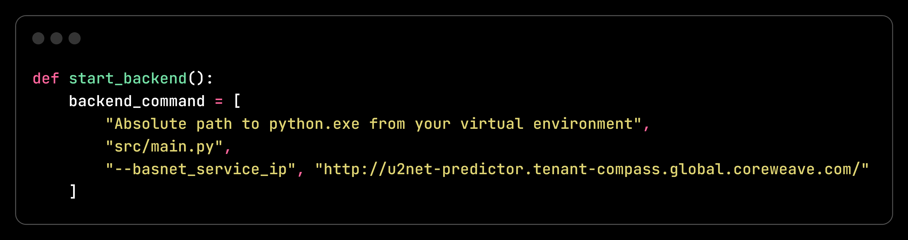

## Desktop App startup command
```bash
python gui.py
```

## Service URLs
- BASNET Predictor: http://basnet-predictor.tenant-compass.global.coreweave.com/
- U2NET Predictor: http://u2net-predictor.tenant-compass.global.coreweave.com/

# Installation

### Setting Up Virtual Environment

1. Create a virtual environment:
```bash
virtualenv -p python3 venv
```

2. Activate the virtual environment:
- On Windows:
```bash
venv\Scripts\activate
```
- On macOS/Linux:
```bash
source venv/bin/activate
```

3. Install dependencies:
```bash
pip install -r requirements.txt
```

4. Add Absolute path to your python.exe from venv/scripts in your gui.py


<!--  -->


## Running the Backend

<!-- backend start command -->
```bash
python src/main.py --basnet_service_ip http://u2net-predictor.tenant-compass.global.coreweave.com/
```